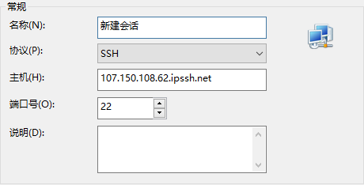

# GlobalSSH


## 产品介绍

GlobalSSH是一款致力于提高跨国远程管理服务器效率的产品，旨在解决因为跨国网络不稳定，通过远程管理服务器时，经常会出现卡顿、连接失败、传输速度较慢等现象。运维研发人员在使用本产品后，可以提高，极大程度的减少卡顿、连接失败的情况发生，提高运维工作的效率。  
注：本产品同样适用于windows服务器的远程登陆服务。如因客户使用场景不是SSH，远程登录等情况导致ddos或网络封堵，产品方保留删除实例权利。

## 场景示例

由于业务需要，某公司的服务器托管于国外，而运维人员在国内办公，经常需要通过SSH登录的方式管理服务器。但是由于网络的波动，通过SSH管理服务器时，经常会出现卡顿、连接失败、传输速度较慢等现象，容易导致运维工作出错、效率变慢，从而间接影响公司业务的正常发展。


## 场景限制
1）GlobalSSH产品定位是方便海外云主机运维管理，故禁止了80、443端口来杜绝大部分web服务，65123作为系统保留端口，也不对外开放。

2）强烈不建议创建多个相同域名的GlobalSSH实例加速不同的端口。因为每个端口会分配一个不同的IP，客户端使用域名接入，无法控制DNS解析到的IP，导致连接端口失败。

3）如果您的业务需要支持更多的端口和更大的带宽，欢迎使用PathX （带宽充足可共享，最多支持50个端口）。

4）如果需要对同一台云主机加速访问多个端口，除了PathX方案，可以考虑使用SSH端口转发，即本地端口代理访问远端服务端口，请确保云主机的sshd配置支持端口转发。命令如下：
```
ssh -L localhost:6443:localhost:6443 root@103.14.35.114.ipssh.net
```

## 如何创建

#### 主机购买页面创建

用户购买主机时，GlobalSSH选项已默认开启。用户成功购买海外主机（需绑定外网弹性IP）后，默认获得对应的GlobalSSH。收费版上线后，创建主机不再默认获得GlobalSSH,需手动开启。

#### 主机或网络产品入口创建

1.进入海外专区的主机或网络产品列表，点击GlobalSSH的灰色图标  


2.在弹出层中选择区域、填写端口，点击确定按钮创建  


#### PathX入口创建

1.进入PathX产品下的GlobalSSH标签页，点击创建按钮  


2.输入需要加速的服务器IP，选择可覆盖你服务器物理位置的区域选项，输入服务器的SSH端口号并创建。  
如：假设服务器在华盛顿，选择华盛顿选项即可；假设服务器在曼谷，可选择能覆盖曼谷区域的香港或新加坡选项  


建议使用第三方云主机的用户从该入口创建GlobalSSH实例。注意：2020年6月开始免费版本不再支持AWS、GCP、Azure、AliCloud等第三方云主机。预计2020年7月上旬GlobalSSH收费版上线后，会重新开放对第三方云主机的支持。

## 如何使用

成功创建后，会生成一个类似xxx.ipssh.net的域名  
  
注：ipssh.net为GlobalSSH产品的正式域名，部分ucloudgda.com结尾的加速域名仍可使用  

**Linux系统**  

在远程登录工具中，使用**加速域名**进行登录。

图形界面连接示意：



命令行登录示意（CentOS）:  
```
ssh root@103.14.35.114.ipssh.net
```

友情提示，当您使用其他友商云主机或不同linux发行版，注意SSH登陆的用户名可能不同

**Windows系统**  
远程桌面连接，以默认端口3389为例，打开系统RDP客户端，计算机处填写加速域名103.14.35.114.ipssh.net，输入用户名及密码点击连接，即可

## 产品价格

GlobalSSH现已免费，不收取实例及流量费用。请合理使用免费资源，若影响到其他用户使用，将触发限速策略。并确保您的账号已进行实名认证。收费版即将上线，规则有所调整，请保持关注。

## 加速失效不可用及恢复

自免费版本实例创建之日起，7日内单个实例累计出向流量小于2MB，加速功能不可用。 若您希望继续使用，可通过如下方式恢复：  
1、登陆UCloud控制台，主机列表页点击目标EIP右侧的SSH图标，在弹出框内（可修改端口等参数）点确认按钮重新创建。  
2、使用UCloud CLI资源管理工具，在您熟悉的命令行工具中执行 
```
ucloud gssh create --location $Location --target-ip $EIP --port $Port
```
3、登陆UCloud控制台PathX产品下 globalssh列表，选择离源站较近的区域，填写源站IP，重新开通即可。

## FAQ

**如何使用 GlobalSSH 白名单功能？**  
该白名单不同于源站的防火墙白名单，仅用来控制可以访问GlobalSSH的来源IP。在GlobalSSH管理列表，点击查看详情，在详情页面左侧基本信息-白名单，进行编辑添加，支持IPv4段或多个IPv4地址。

**使用 GlobalSSH 端口不通**   
1）实例运行需要1分钟的启动时间。超出该时间后，先确认源站的相同端口是否可以连接；

2）在 GlobalSSH 实例详情页，检查下访问白名单，如果配置了白名单，出现在白名单中的IP才可以连接；

3）中国大陆地区Ping GlobalSSH 的域名，如果可以 Ping 通，试试 telnet GlobalSSH域名 端口 是否可以连接（无法连接提供给我们）；如果 Ping 不通，请dig下 GlobalSSH域名，将结果提供给我们。

